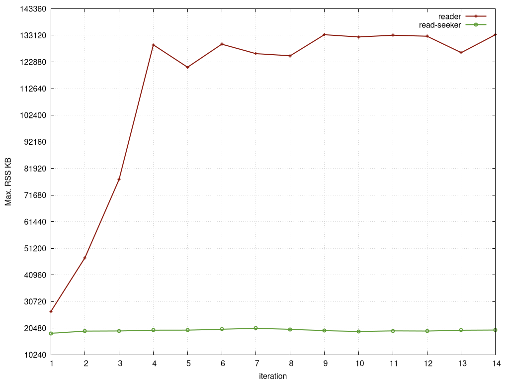

# aws-sdk-go S3 Uploader Memory Usage io.Reader vs io.ReadSeeker

This repository contains Go-Programs to analyze the memory usage of the
aws-sdk-go and aws-sdk-go-v2 libraries when uploading files via the upload
manager.

The tools start **N** go-routines that upload files via the same upload
manager in parallel. Then they wait until all go-routines have terminated.
This is done in a loop **X** times.

**Behavior:**
- When an IO.Reader is passed to the S3 `Upload()` method, every increase of
  **X** increases the max. RSS memory the Go-Program uses up to a maximum. The
  maximum depends on the number of parallel uploads (**N**).
  The memory usage grows up to ~133MB to upload 10x1B data in parallel.

**Expected Behaviour:**
- Increasing **X** only increases the memory usage slightly. The memory
  of the previous iteration is reused.
  When an IO.ReadSeeker is used, the memory usage is as expected.


**Uploading 1B in parallel in 10 go-routines:**


## Howto

### Compile Binaries

```sh
make
```

resulting binaries:
- `bin/v1` -> uses aws-sdk-go
- `bin/v2` -> uses aws-sdk-go-v2

### Check Memory Consumption

gnu-time is an easy way to print the peak RSS memory that a program used:

Compare memory usage of:

```sh
/usr/bin/time -v bin/v2 -parallel-uploads 10 -repeat 10 -with-read-seeker
```

vs using an io.Reader:

```sh
/usr/bin/time -v bin/v2 -parallel-uploads 10 -repeat 10
```

### Run a Benchmark and create a Gnuplot Graph

Edit the parameters in `benchmarks.sh` as wished.
Run:

```sh
./benchmark.sh
```

A PNG file will be created in the current directory.
